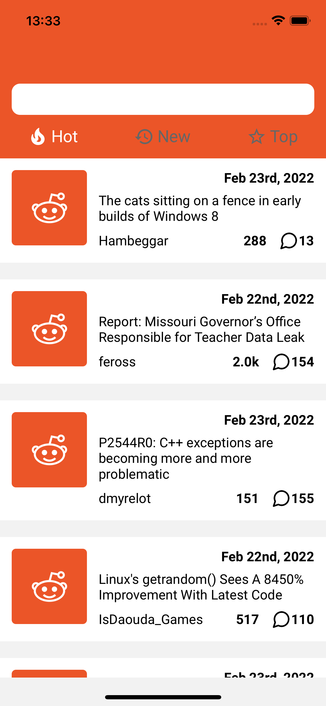
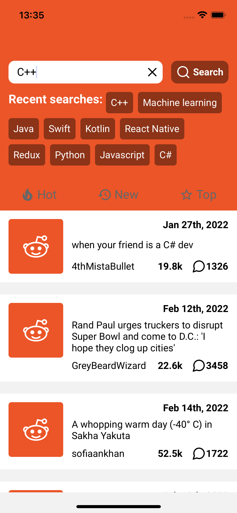

# React Native Reddit

  
  

### Technologies and used packages
- [x] React Native
- [x] Typescript
- [x] Redux Toolkit
- [x] Redux Persist

### Environment setup
Follow the setup instructions on [React Native webpage](https://reactnative.dev/docs/environment-setup). Make sure you're setting up the React Native CLI, not hte expo

### Running the app
After setting um the development environment to you computer's operating system, follow the following steps:
- Clone the repository and open it in a terminal
- Install project dependencies: run `npm install` or `yarn install` (yarn is preferrable)
- Install pods (iOS only): open the ios folder inside of project directory and run `pod install`
- Start Metro Bundler: on the root directory of the project, run `yarn start` or `npm run start` on a terminal
- Run the app: open another terminal on the root directory and run `yarn android` or `npm run android` for Android devices, and `yarn ios` or `npm run ios` for ios devices